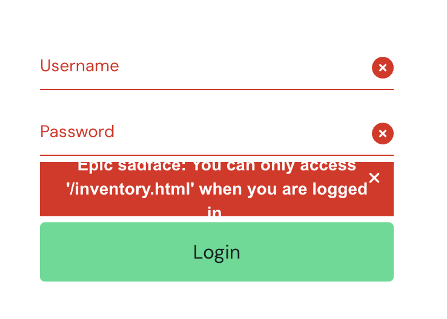

# Sauce Demo — Playwright Tests (Tech Test)

This project uses **Playwright** and **TypeScript** to test
[Sauce Demo](https://www.saucedemo.com/).

I focused on login, cart updates, and checkout — the main shopping journey —
covering both successful scenarios and error cases.

---

## Setup

**Requirements**

- Node.js 20 or newer
- npm

**Installation**

Clone this repository (or download and extract it), open a terminal in the
project folder, and run:

```bash
npm ci
npx playwright install --with-deps chromium
```

The tests run on Chromium against the public Sauce Demo website, so no local
application server is needed.

---

## How to run the tests

```bash
npm test             # run all tests headless
npm run test:headed  # run with a visible browser
npm run test:ui      # open Playwright's interactive UI
npm run report       # open the HTML report after a run
npm run typecheck    # type-check with tsc
npm run format       # format with Prettier (writes changes)
npm run format:check # check formatting without writing
```

In UI mode, enable the `setup` project in the project filter and run
`auth.setup.ts` before running the cart or checkout tests. Run it again if the
saved authentication expires.

The HTML report shows passed and failed tests, error details, and screenshots
captured on failure. In CI, failed tests are retried once, with a trace
recorded on the retry.

---

## GitHub Actions

Tests run automatically on pushes to `main` and on pull requests targeting
`main` when they are opened, updated, or reopened (including draft PRs). The CI
run type-checks first, then runs the suite, an in-progress run is cancelled when
a newer commit is pushed to the same branch or PR.

The workflow uploads the HTML report when available — including after failures,
unless the run is cancelled. Reports can be downloaded from the run's
**Artifacts** section and are kept for seven days.

---

## Test coverage

The suite has six scenario tests plus one authentication setup test. I
prioritised the flows most critical to this app's purpose — a user logging in
and completing a purchase.

| Scenario | What is checked |
| --- | --- |
| Successful login | The standard user reaches the inventory page and six products appear. |
| Invalid password | The expected error appears and the user stays on the login page. |
| Locked-out user | The expected locked-out error appears. |
| Cart updates | Adding and removing products updates the badge and leaves the correct product in the cart. |
| Successful checkout | The overview shows the selected products, the totals add up, and the order is confirmed. |
| Checkout validation | Submitting an empty customer-details form shows the first-name error and blocks progress. |

The checkout test compares the subtotal against prices read from the inventory,
and checks that subtotal plus displayed tax equals the grand total. It does not
yet validate the tax rate independently.

---

## Project structure

```
pages/                  Reusable locators and page actions
tests/                  Test scenarios, authentication setup, and test data
utils/                  Price parsing helper
playwright.config.ts    Test settings
.github/workflows/      GitHub Actions workflow
```

Page objects keep reusable actions together; the tests describe the expected
results. Locator assertions wait and retry, so there are no fixed sleeps.

---

## Design decisions

- **Page Object Model** — locators and actions live in one class per screen,
  reducing duplication and making changes easier to maintain.
- **Locators reflect a testing contract** — I use the app's `data-test` IDs
  wherever they exist, since they are meant for testing and are less likely to
  change during a visual restyle. Buttons use accessible roles and names
  (`getByRole('button', { name: 'Add to cart' })`), and a product is picked by
  its exact visible name. This reduces dependence on styling classes.
- **Assertions check outcomes, not just that a page loaded** — exact error text,
  badge counts, cart contents, price arithmetic, and order confirmation.
- **Web-first assertions** — `expect(locator).toHaveText(...)` and friends
  auto-wait and retry, so there are no fixed sleeps and less timing flakiness.
- **Fail fast and loud** — the price helper handles Sauce Demo's simple dollar
  format and throws when no finite amount can be extracted, so a bad value
  surfaces at its source instead of as a confusing failure later.

---

## Why I use storage state

Login is tested on its own through the UI. For cart and checkout, being logged
in is just a starting condition so the setup test logs in once and saves the
authentication state, which each cart and checkout test loads into its own
browser context. This avoids repeating the login steps while keeping each
test's browser state separate.

Saved authentication state and generated reports are excluded from Git. The
credentials in the test data are Sauce Demo's public demo credentials.

---

## Manual testing observations

My manual testing focused on `standard_user`. The other supplied users have
different or intentionally broken behaviour and were outside this review; the
automated suite separately covers the locked-out login case.

| Area | Observation | Follow-up |
| --- | --- | --- |
| Empty-cart checkout | An order can be completed without adding any products (total $0). | Confirm whether this should be blocked, then add a regression test. |
| Reset App State | Resetting from the hamburger menu cleared the cart, but the inventory button still showed "Remove" until the page was refreshed. | Check that cart contents, the badge, and product buttons update immediately after reset. |
| Direct URL access + error layout | Opening `/inventory.html` directly while logged out correctly blocks access and shows a "login required" message (auth guard works). But the banner does not resize to fit this longer message — the text overflows and the last line is clipped behind the Login button (see below). | Auth behaviour is correct; investigate the banner layout and check the full message stays visible at different viewport sizes. |
| Product quantity | A product can only be added once; there is no quantity selector. | Likely a product limitation rather than a defect; consider quantity selection as an improvement. |

Error banner overflow when accessing a protected page directly:



---

## To Do — with more time

### Next on this app

1. **Follow up on the manual findings above.** Reproduce the error-layout and
   reset behaviour, confirm the expected behaviour for empty-cart checkout, then
   add regression tests.
2. **Add more cart and checkout tests** — remove a product from the cart page,
   remove the last product, continue shopping, and cancel checkout.
3. **Check data persistence** — cart contents after a page refresh, and state
   after login/logout.
4. **Expand input validation** — required fields, max lengths, whitespace, and
   invalid characters. Test each missing checkout field with the others filled
   in, and confirm the rules before treating special characters as invalid
   (especially names and addresses).
5. **Validate the tax amount** — the checkout currently only checks that the
   totals are self-consistent (items + tax = grand total); also assert the
   displayed tax equals the expected percentage of the subtotal.
6. **Cross-browser and viewport coverage** — run the main journeys on Firefox
   and WebKit as well as Chromium, and at desktop and mobile viewport sizes.
7. **Visual testing** — functional tests can pass even when images, spacing, or
   layout are wrong; add screenshot comparisons for key pages and states.
8. **Linting** — add ESLint with Playwright-specific rules to catch common test
   mistakes and keep the code consistent.
9. **Improve the PR workflow** — the workflow already cancels stale runs; next I
   would skip the test job while a PR is a draft and run it once it is ready for
   review.
10. **Explore Playwright MCP** — let an AI agent try exploratory flows and
    suggest additional tests. Review the suggested tests and confirm the expected
    behaviour before adding them.

### Real-world extensions (beyond this demo)

Sauce Demo does not include these, but they would be critical in a production
shop, so I would prioritise them there:

- **Payment / checkout failure handling** — test declined payments, timeouts, and
  retries using a payment sandbox and controlled failure simulation. Check for
  clear error messages, consistent order/payment status, and prevention of
  duplicate charges.
- **Currency and international tax rules** — test tax and currency per country,
  first confirming whether they depend on IP, account settings, or
  billing/shipping address, then testing the relevant combinations.
- **API testing** — use APIs to create and clean up test data (less repeated UI
  setup), and test cart contents, quantities, prices, invalid requests, and
  access control, asserting response bodies and resulting state as well as
  status codes.

---

## AI assistance

I used AI to help draft and review code and documentation. I made the final
decisions on test scope and implementation, reviewed the suggestions, and
adapted them based on my manual testing and understanding of the application.
